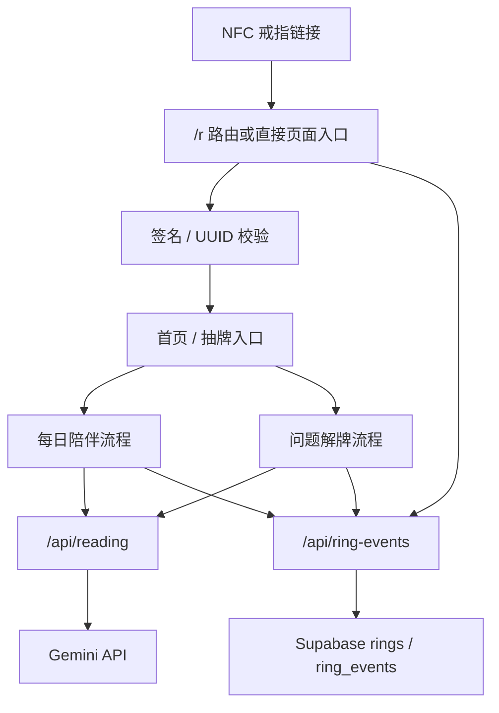

## 1. 目标

本架构用于支撑一个移动端优先的 NFC 戒指 H5 产品，包含 AI 解读、Supabase 追踪和 Vercel 部署。

关键目标：

- 移动端快速加载。
- 路由和用户流程清晰。
- AI API 通过 Serverless 隔离。
- Supabase 行为事件可靠记录。
- 解读页 UX 可以快速迭代。
- 未来可支持 Memory Ring 内容存储。

## 2. 当前技术栈

| 领域 | 技术 |
| --- | --- |
| 前端 | Vue 3 |
| 构建 | Vite |
| 样式 | Tailwind utility classes |
| 部署 | Vercel |
| Serverless API | Vercel functions，位于 `api/` |
| 数据库 | Supabase PostgreSQL |
| 文件存储 | Supabase Storage，未来用于 Memory Ring |
| AI | Gemini API |

## 3. 高层流程



## 4. 关键代码区域

- 路由：`src/router/index.js`
- 每日页面：`src/pages/DailyCardPage.vue`
- 问题页面：`src/pages/LoveEnergyPage.vue`
- 每日结果面板：`src/components/draw/DailyReadingPanel.vue`
- 问题结果面板：`src/components/draw/LoveReadingPanel.vue`
- 抽牌与解读服务：`src/services/drawSession.js`
- 解读 API：`api/reading.js`
- 戒指事件 API：`api/ring-events.js`
- 戒指校验 API：`api/ring-verify.js`

## 5. 数据与追踪

核心概念：

- `rings`：记录已知戒指 UUID 和生命周期信息。
- `ring_events`：追加式记录使用事件。
- `RING_SIGNING_SECRET`：当前签发新 NFC 链接的主 secret。
- `RING_SIGNING_SECRET_PREVIOUS` / `RING_SIGNING_SECRET_LEGACY` / `RING_SIGNING_SECRETS`：仅用于兼容历史已发货戒指链接的校验。

新增或修改事件时，必须记录到对应功能模块 / 用户故事。

示例事件：

- `ring_verified`
- `home_opened`
- `reading_completed`

## 6. 解读 UX 架构

每日解读和问题解读故意采用不同信息架构。

每日解读：

- 用户没有明确问题。
- UX 应像一页简短日记。

问题解读：

- 用户已经提出问题。
- UX 应先给答案，再解释原因。

Gemini 输出需要同时通过 API prompt 和前端格式化进行约束。

当前约定的结构重点：

- 每日陪伴：`todaysEnergy`、`forYourHeart`、`oneSmallAction`、`companionNote`
- 问题解牌：`reflection`、`cardReadings`、`combined`、`gentleReminder`、`followUps`

## 7. 部署

默认验证：

```bash
npm run build
```

生产部署：

```bash
npx vercel@latest deploy --prod --yes
```

除非用户明确要求跳过，否则生产部署前必须先验证构建。
