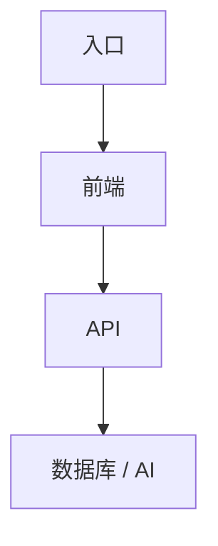

## 1. 目标

描述项目架构目标。

## 2. 技术栈

| 领域 | 技术 |
| --- | --- |
| 前端 |  |
| 构建 |  |
| 部署 |  |
| 数据库 |  |
| AI |  |

## 3. 高层流程

## 4. 关键代码区域

- 路由：
- 页面：
- 组件：
- 服务：
- API：

## 5. 数据与追踪

记录主要数据表、事件和生命周期规则。

## 6. 部署

构建和部署命令。

